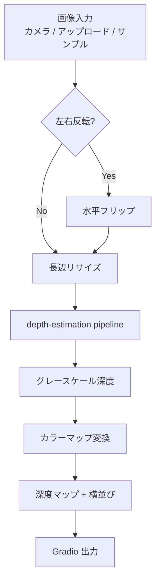
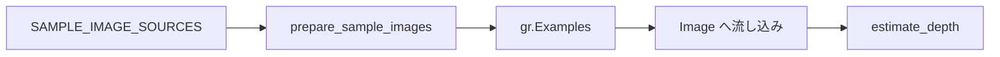

# document.md — 深度推定デモ（OC_DepthAnything）

本ドキュメントは，オーダー `orders/order_007.md` に基づく Depth Anything デモの構成と，主要関数の関係をまとめたものである．

---

## 1. 成果物

| ファイル | 役割 |
| :--- | :--- |
| `OC_DepthAnything.ipynb` | Colab 上で完結する実行本体（インストール／初期化／Gradio） |
| `OC_DepthAnything.md` | 高校生・実施者向けの操作説明 |
| `document.md` | 本仕様・処理フローの解説 |

深度推定は Colab 内の Depth Anything V2 推論のみで行い，Gemini API は用いない（API キー不要）．Hugging Face 認証も不要である（公開モデル）．

---

## 2. ノートブックのセル構成

実行が途中で止まった場合に再開しやすいよう，次の段階に分割している．

0. **設定** — `MIRROR_WEBCAM`，`MODEL_SIZE`，`COLORMAP_NAME`，`MAX_IMAGE_SIDE`
1. **ライブラリのインストール** — `transformers` の更新
2. **ライブラリの読み込み，変数のインスタンス化** — フォント／サンプル画像のダウンロード，パイプラインとヘルパの定義
3. **Gradio の実行** — UI 構築と `demo.launch(share=True)`

---

## 3. 処理フロー

サンプル画像は推論とは独立に URL から取得し，Gradio Examples に渡す．

モデルサイズと Hugging Face 上の ID の対応は次のとおりである．

| `MODEL_SIZE` | Hugging Face ID |
| :--- | :--- |
| `small` | `depth-anything/Depth-Anything-V2-Small-hf` |
| `base` | `depth-anything/Depth-Anything-V2-Base-hf` |
| `large` | `depth-anything/Depth-Anything-V2-Large-hf` |

---

## 4. 主要関数の仕様

### 4.1 環境・データ準備

| 関数 | 概要 | 主な入出力 |
| :--- | :--- | :--- |
| `resolve_device` | CUDA 可否を判定する | → `str`（`"cuda"` / `"cpu"`） |
| `download_bytes` | URL からバイナリを保存する | `url: str`, `save_path: Path` → `Path` |
| `download_image` | URL から画像を取得し長辺を制限して保存する | `url`, `save_path` → `Path` |
| `download_font` | 日本語ラベル用フォントを取得する | `url`, `save_path` → `Path` |
| `prepare_sample_images` | サンプル写真を一括ダウンロードする | `sources`, `sample_dir` → `list[tuple[str, Path]]` |
| `resolve_colormap` | カラーマップ名を OpenCV 定数へ変換する | `name: str` → `int` |
| `load_depth_pipeline` | Depth Anything の pipeline を構築する | `model_size`, `device` → `Pipeline` |

### 4.2 前処理・可視化

| 関数 | 概要 | 主な入出力 |
| :--- | :--- | :--- |
| `to_rgb_uint8` | Gradio 入力を RGB uint8 に揃える | `image` → `np.ndarray (H,W,3)` または `None` |
| `resize_long_side` | 長辺を上限以下に縮小する | `rgb`, `max_side` → `np.ndarray` |
| `prepare_input_image` | ミラー・リサイズを適用する | `image`, `mirror` → `np.ndarray` または `None` |
| `depth_to_colormap` | グレースケール深度を疑似カラー化する | `depth_gray`, `colormap` → `np.ndarray (H,W,3)` |
| `make_side_by_side` | 原画像と深度を横連結する | `left_rgb`, `right_rgb` → `np.ndarray (H,2W,3)` |
| `draw_status_label` | 画像左上に短い説明を描く | `rgb`, `text` → `np.ndarray` |
| `format_depth_summary` | 相対深度の説明文を作る | `depth_gray`, `h`, `w` → `str` |

### 4.3 Gradio コールバック

| 関数 | 概要 | 主な入出力 |
| :--- | :--- | :--- |
| `estimate_depth` | 深度推定のメイン処理 | 画像・ミラー・カラーマップ → 深度図，横並び，説明文 |
| `build_demo` | UI を構築する | `sample_items` → `gr.Blocks` |

---

## 5. Gradio UI の入出力

| 種別 | コンポーネント | 内容 |
| :--- | :--- | :--- |
| 入力 | `gr.Image` | カメラ／アップロード（`sources=["webcam","upload"]`） |
| 入力 | `gr.Dropdown` | カラーマップ（INFERNO など） |
| 入力 | `gr.Checkbox` | 左右反転 |
| 入力 | `gr.Examples` | インターネット取得のサンプル画像 |
| 出力 | `gr.Image` | 深度カラーマップ |
| 出力 | `gr.Image` | 原画像 \| 深度マップ |
| 出力 | `gr.Textbox` | 相対深度の要約 |

---

## 6. 設計上の留意点

- T4（約 14GB）向けに既定モデルを `small`，長辺上限を `1024` としている．
- 出力はメートル単位の絶対距離ではなく，相対的な遠近の可視化である．
- インストール直後のモジュールキャッシュ不整合を想定し，セッション再起動を案内している．
- サンプル画像は撮影なしでもデモできるよう，奥行きが分かりやすい題材を選んでいる．

---

## 7. 依存関係（Colab 前提）

Colab 標準環境に加え，次を利用する．

- `transformers`（`pipeline(task="depth-estimation")`）
- `torch` / `gradio` / `opencv-python` / `Pillow` / `tqdm` / `numpy`

Gemini（`gemini-2.5-flash`）および `tokens.json` は本デモでは使用しない．
