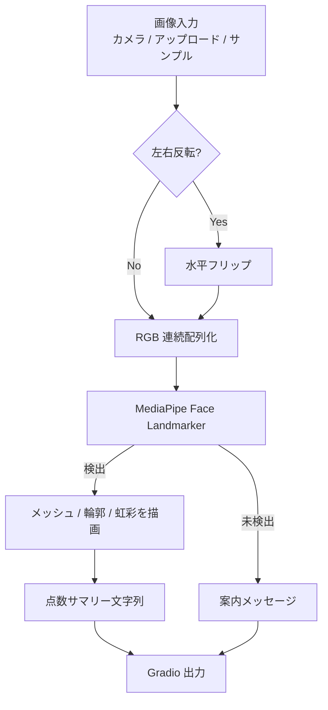
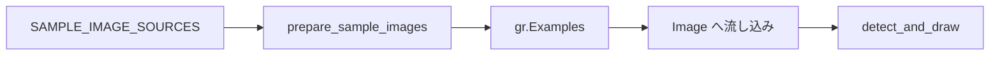

# document.md — 顔ランドマーク検出デモ（OC_FaceLandmark）

本ドキュメントは，オーダー `orders/order_005.md` に基づく顔ランドマーク検出デモの構成と，主要関数の関係をまとめたものである．

---

## 1. 成果物

| ファイル | 役割 |
| :--- | :--- |
| `OC_FaceLandmark.ipynb` | Colab 上で完結する実行本体（インストール／初期化／Gradio） |
| `OC_FaceLandmark.md` | 高校生・実施者向けの操作説明 |
| `document.md` | 本仕様・処理フローの解説 |

顔ランドマーク検出は Colab 内の MediaPipe 推論のみで行い，Gemini API は用いない（API キー不要）．Hugging Face 認証も不要である．

---

## 2. ノートブックのセル構成

実行が途中で止まった場合に再開しやすいよう，次の段階に分割している．

0. **設定** — `MIRROR_WEBCAM`，`MAX_NUM_FACES`，描画フラグ，モデル URL／パス
1. **ライブラリのインストール** — `mediapipe` の導入
2. **ライブラリの読み込み，変数のインスタンス化** — フォント／サンプル画像／`.task` モデルのダウンロード，検出器とヘルパの定義
3. **Gradio の実行** — UI 構築と `demo.launch(share=True)`

---

## 3. 処理フロー

サンプル画像は推論とは独立に URL から取得し，Gradio Examples に渡す．

---

## 4. 主要関数の仕様

### 4.1 環境・データ準備

| 関数 | 概要 | 主な入出力 |
| :--- | :--- | :--- |
| `download_bytes` | URL からバイナリを取得して保存する | `url: str`, `save_path: Path` → `Path` |
| `download_image` | URL から画像を取得し長辺を制限して保存する | `url: str`, `save_path: Path` → `Path` |
| `download_font` | 日本語ラベル用フォントを取得する | `url`, `save_path` → `Path` |
| `prepare_sample_images` | サンプル顔写真を一括ダウンロードする | `sources`, `sample_dir` → `list[tuple[str, Path]]` |
| `load_face_landmarker` | Face Landmarker を構築する | `model_path`, `num_faces` → `FaceLandmarker` |

### 4.2 検出・可視化

| 関数 | 概要 | 主な入出力 |
| :--- | :--- | :--- |
| `to_rgb_uint8` | Gradio 入力を RGB `uint8 (H,W,3)` に揃える | `image` → `np.ndarray` または `None` |
| `landmark_to_pixel` | 正規化座標をピクセルへ変換する | `landmark`, `width`, `height` → `(x, y)` |
| `draw_connections` | 接続線を描画する（インプレース） | `rgb (H,W,3)`, `landmarks`, `connections` |
| `draw_landmark_dots` | 全点をドット描画する | `rgb`, `landmarks` |
| `draw_face_label` | 日本語ラベルを描画する | `rgb`, `text`, `org` → `np.ndarray (H,W,3)` |
| `format_detection_summary` | 顔数・点数の説明文を作る | `face_landmarks_list` → `str` |
| `detect_and_draw` | 検出の入口（Gradio コールバック） | `image`, `mirror` → `(可視化画像, テキスト)` |

### 4.3 UI

| 関数 | 概要 | 戻り値 |
| :--- | :--- | :--- |
| `build_demo` | カメラ入力・Examples・結果表示を配置する | `gr.Blocks` |

入力は顔画像（カメラ／アップロード）を主とし，サンプルは Examples で提供する．多くの利用者が日本人であることを踏まえ，サンプルに日本人・アジア系の公開写真を含める．

---

## 5. モデル利用方針

- パッケージ: `mediapipe`（Tasks API の `vision.FaceLandmarker`）
- モデル: 公式 `face_landmarker.task`（float16）
- 取得 URL: Google Cloud Storage 上の MediaPipe モデル配信
- 実行モード: `RunningMode.IMAGE`（静止画／1 フレーム入力）
- 最大顔数: 設定セルの `MAX_NUM_FACES`（既定 3）
- 描画: `FaceLandmarksConnections` の TESSELATION / CONTOURS / IRIS を OpenCV で線描画

Gemini API および Hugging Face モデルは使用しない．

---

## 6. 依存関係（Colab 前提）

| パッケージ | 備考 |
| :--- | :--- |
| `mediapipe` | セル1でインストール |
| `gradio` | Colab 標準（本環境では 6.x 系） |
| `opencv-python`（`cv2`） | 描画・画像 I/O（Colab 標準） |
| `Pillow` | 日本語ラベル描画 |
| `numpy` | 配列処理 |
| `tqdm` | サンプル DL および推論の進捗（`leave=False`） |

PyTorch の再インストールは行わない．MediaPipe は Colab 上で動作することを前提とする（一部のローカル環境では OpenGL ES 共有ライブラリが必要な場合がある）．

---

## 7. サンプル画像

| ローカル名 | 出典の傾向 |
| :--- | :--- |
| `happy_japanese_woman.jpg` | Wikimedia Commons（日本人・笑顔） |
| `happy_japanese_smile.jpg` | Wikimedia Commons（日本人・スマイル） |
| `neutral_japanese.jpg` | Wikimedia Commons（日本人） |
| `asian_portrait.jpg` ほか | Pexels 公開ポートレート |

ノートブック単体で動作するよう，リポジトリへの画像同梱は行わず，初期化時にダウンロードする．モデル `.task` も同様に初期化時に取得する．

---

## 8. 設計上の留意点

- ネストを浅く保つため，DL・座標変換・描画・検出コールバック・UI を独立関数に分割した
- 重い処理の進捗は `tqdm(..., leave=False)` で可視化する
- API キーは不要とし，ノートブック本文へ秘密情報を埋め込まない
- カメラ利用が難しい環境でも，アップロードとサンプルで動作確認できるようにした
- 日本語ラベル描画のため，Noto Sans JP（サブセット）を初期化時に取得する
- 旧 `mp.solutions.face_mesh` の描画 API に依存せず，Tasks の接続定義と OpenCV で可視化する
