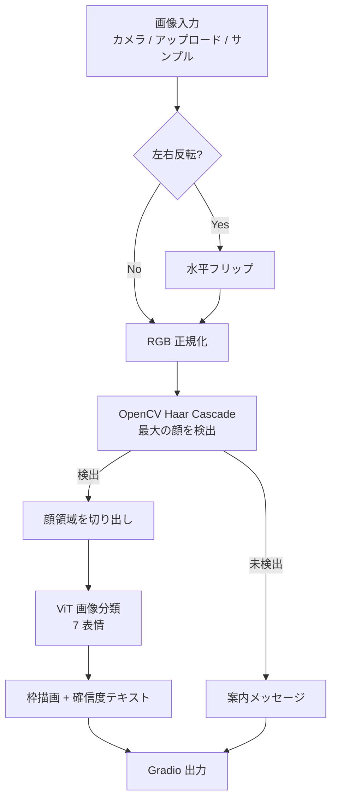

# document.md — 表情認識デモ（OC_FacialExpression）

本ドキュメントは，オーダー `orders/order_004.md` に基づく表情認識デモの構成と，主要関数の関係をまとめたものである．

---

## 1. 成果物

| ファイル | 役割 |
| :--- | :--- |
| `OC_FacialExpression.ipynb` | Colab 上で完結する実行本体（インストール／初期化／Gradio） |
| `OC_FacialExpression.md` | 高校生・実施者向けの操作説明 |
| `document.md` | 本仕様・処理フローの解説 |

表情認識は Colab 内の顔検出と ViT 推論のみで行い，Gemini API は用いない（API キー不要）．

---

## 2. ノートブックのセル構成

実行が途中で止まった場合に再開しやすいよう，次の段階に分割している．

0. **設定** — `MIRROR_WEBCAM`，`MODEL_ID`，`FACE_MARGIN`
1. **ライブラリのインストール** — `transformers` の更新
2. **ライブラリの読み込み，変数のインスタンス化** — フォント／サンプル画像のダウンロード，顔検出 cascade と表情分類パイプラインの構築，推論ヘルパの定義
3. **Gradio の実行** — UI 構築と `demo.launch(share=True)`

---

## 3. 処理フロー

サンプル画像は推論とは独立に URL から取得し，Gradio Examples に渡す．

---

## 4. 主要関数の仕様

### 4.1 環境・データ準備

| 関数 | 概要 | 主な入出力 |
| :--- | :--- | :--- |
| `resolve_device` | CUDA 可否を判定する | 戻り値: `str`（`"cuda"` / `"cpu"`） |
| `download_file` | URL から画像を取得し長辺を制限して保存する | `url: str`, `save_path: Path` → `Path` |
| `download_font` | 日本語ラベル用フォントを取得する | `url`, `save_path` → `Path` |
| `prepare_sample_images` | サンプル顔写真を一括ダウンロードする | `sources`, `sample_dir` → `list[tuple[str, Path]]` |

### 4.2 検出・認識

| 関数 | 概要 | 主な入出力 |
| :--- | :--- | :--- |
| `load_face_cascade` | Haar Cascade を読み込む | → `cv2.CascadeClassifier` |
| `load_emotion_pipeline` | Transformers の画像分類パイプラインを構築する | `model_id`, `device` → `Pipeline` |
| `detect_largest_face` | 最大の顔枠 `(x1,y1,x2,y2)` を返す | `rgb (H,W,3)`, `cascade` → `tuple` または `None` |
| `predict_emotion` | 認識の入口（Gradio コールバック） | `image`, `mirror` → `(可視化画像, テキスト)` |

### 4.3 UI・可視化

| 関数 | 概要 | 戻り値 |
| :--- | :--- | :--- |
| `draw_face_box` | 顔枠と日本語ラベルを描画する | `np.ndarray (H,W,3)` |
| `format_predictions` | 7 クラスの確信度を日本語テキストにする | `str` |
| `build_demo` | カメラ入力・Examples・結果表示を配置する | `gr.Blocks` |

入力は顔画像（カメラ／アップロード）を主とし，サンプルは Examples で提供する．多くの利用者が日本人であることを踏まえ，サンプルに日本人・アジア系の公開写真を含める．

---

## 5. モデル利用方針

- パッケージ: `transformers.pipeline`（`task="image-classification"`）
- モデル ID: `trpakov/vit-face-expression`（設定セルで変更可能）
- 参考 URL: https://huggingface.co/trpakov/vit-face-expression
- 学習データ: FER2013（7 表情）
- 前処理: OpenCV で顔を検出し，余白付きで切り出してから分類する
- デバイス: CUDA 利用可能時は GPU（`device=0`），それ以外は CPU

FER2013 由来のため，データ分布の偏りにより日本人顔で誤分類することがある．デモ説明ではその限界にも触れる．

---

## 6. 依存関係（Colab 前提）

| パッケージ | 備考 |
| :--- | :--- |
| `transformers` | セル1で必要に応じ更新 |
| `gradio` | Colab 標準（本環境では 6.x 系） |
| `torch` | Colab 標準 |
| `opencv-python`（`cv2`） | 顔検出・画像 I/O（Colab 標準） |
| `Pillow` | 日本語ラベル描画 |
| `tqdm` | サンプル DL および推論の進捗（`leave=False`） |

PyTorch の再インストールは行わず，Colab 同梱の CUDA 対応ビルドを利用する．Hugging Face 認証は不要である．

---

## 7. サンプル画像

| ローカル名 | 出典の傾向 |
| :--- | :--- |
| `happy_japanese_woman.jpg` | Wikimedia Commons（日本人・笑顔） |
| `happy_japanese_smile.jpg` | Wikimedia Commons（日本人・スマイル） |
| `neutral_japanese.jpg` | Wikimedia Commons（日本人） |
| `asian_portrait.jpg` ほか | Pexels 公開ポートレート（笑い・真剣・驚き寄り） |

ノートブック単体で動作するよう，リポジトリへの画像同梱は行わず，初期化時にダウンロードする．

---

## 8. 設計上の留意点

- ネストを浅く保つため，デバイス判定・DL・検出・分類・UI を独立関数に分割した
- 重い処理の進捗は `tqdm(..., leave=False)` で可視化する
- API キーは不要とし，ノートブック本文へ秘密情報を埋め込まない
- カメラ利用が難しい環境でも，アップロードとサンプルで動作確認できるようにした
- 日本語ラベル描画のため，Noto Sans JP（サブセット）を初期化時に取得する
