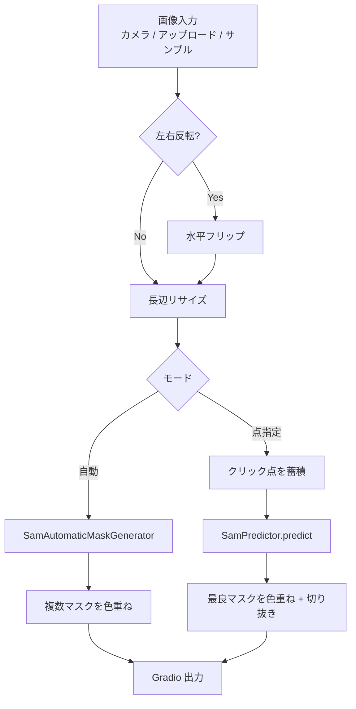
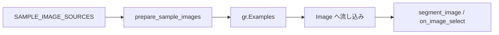
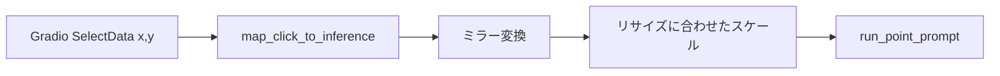

# document.md — セグメンテーションデモ（OC_SegmentAnything）

本ドキュメントは，オーダー `orders/order_006.md` に基づく Segment Anything デモの構成と，主要関数の関係をまとめたものである．

---

## 1. 成果物

| ファイル | 役割 |
| :--- | :--- |
| `OC_SegmentAnything.ipynb` | Colab 上で完結する実行本体（インストール／初期化／Gradio） |
| `OC_SegmentAnything.md` | 高校生・実施者向けの操作説明 |
| `document.md` | 本仕様・処理フローの解説 |

セグメンテーションは Colab 内の SAM 推論のみで行い，Gemini API は用いない（API キー不要）．Hugging Face 認証も不要である（チェックポイントは Meta 公式 CDN）．

---

## 2. ノートブックのセル構成

実行が途中で止まった場合に再開しやすいよう，次の段階に分割している．

0. **設定** — `MIRROR_WEBCAM`，`SAM_MODEL_TYPE`，`POINTS_PER_SIDE`，`MAX_IMAGE_SIDE`
1. **ライブラリのインストール** — `segment-anything` の導入
2. **ライブラリの読み込み，変数のインスタンス化** — フォント／サンプル画像／チェックポイントのダウンロード，モデルとヘルパの定義
3. **Gradio の実行** — UI 構築と `demo.launch(share=True)`

---

## 3. 処理フロー

サンプル画像は推論とは独立に URL から取得し，Gradio Examples に渡す．

点指定では，表示座標をミラー・リサイズ後の推論座標へ写像する．

---

## 4. 主要関数の仕様

### 4.1 環境・データ準備

| 関数 | 概要 | 主な入出力 |
| :--- | :--- | :--- |
| `resolve_device` | CUDA 可否を判定する | → `str`（`"cuda"` / `"cpu"`） |
| `download_bytes` | URL からバイナリを保存する | `url: str`, `save_path: Path` → `Path` |
| `download_image` | URL から画像を取得し長辺を制限して保存する | `url`, `save_path` → `Path` |
| `download_font` | 日本語ラベル用フォントを取得する | `url`, `save_path` → `Path` |
| `prepare_sample_images` | サンプル写真を一括ダウンロードする | `sources`, `sample_dir` → `list[tuple[str, Path]]` |
| `load_sam` | SAM / Predictor / 自動生成器を構築する | `model_type`, `device` → `(sam, predictor, mask_generator)` |

### 4.2 前処理・可視化

| 関数 | 概要 | 主な入出力 |
| :--- | :--- | :--- |
| `to_rgb_uint8` | Gradio 入力を RGB `uint8 (H,W,3)` に揃える | `image` → `np.ndarray` または `None` |
| `resize_long_side` | 長辺を上限以下へ縮小する | `rgb (H,W,3)`, `max_side` → `rgb (H',W',3)` |
| `image_fingerprint` | クリック状態リセット用の簡易指紋 | `rgb` → `tuple` |
| `overlay_masks` | 複数マスクを半透明色で重ねる | `rgb`, `masks` → `rgb (H,W,3)` |
| `make_cutout` | マスク外を白にした切り抜きを作る | `rgb`, `mask` → `rgb (H,W,3)` |
| `draw_points_on_image` | クリック点を描画する | `rgb`, `points` → `rgb (H,W,3)` |
| `draw_status_label` | 日本語ステータスを描画する | `rgb`, `text` → `rgb (H,W,3)` |
| `map_click_to_inference` | 表示クリックを推論座標へ変換する | `image`, `mirror`, `click_xy` → `(rgb, (x,y))` |

### 4.3 推論・UI

| 関数 | 概要 | 主な入出力 |
| :--- | :--- | :--- |
| `run_automatic` | 画像全体を自動分割する | `rgb`, `alpha` → `(可視化, 切り抜き, 説明文)` |
| `run_point_prompt` | 前景点プロンプトで分割する | `rgb`, `points`, `alpha` → `(可視化, 切り抜き, 説明文)` |
| `segment_image` | ボタン実行の入口 | Gradio 入力 → 出力 3 点 |
| `on_image_select` | 画像クリック時の入口 | Gradio 入力 + `SelectData` → 出力 3 点 |
| `reset_click_points` | クリック点をクリアする | Gradio 入力 → 出力 3 点 |
| `build_demo` | カメラ・Examples・結果表示を配置する | `sample_items` → `gr.Blocks` |

入力は写真（カメラ／アップロード）を主とし，サンプルは Examples で提供する．撮影しなくてもデモできるよう，人物・動物・日常物体の公開画像を含める．

---

## 5. モデル利用方針

- パッケージ: Meta 公式 `segment-anything`
- 既定モデル: `vit_b`（T4 向け．チェックポイント約 375MB）
- 取得 URL: `https://dl.fbaipublicfiles.com/segment_anything/sam_vit_b_01ec64.pth`
- 自動分割: `SamAutomaticMaskGenerator`（`points_per_side` は設定セルで調整）
- 点指定: `SamPredictor`（同一画像では埋め込みを再利用）
- 画像サイズ: 推論前に長辺を `MAX_IMAGE_SIDE`（既定 1024）以下へ縮小

Gemini API および Hugging Face 上のモデル取得は使用しない．

---

## 6. 依存関係（Colab 前提）

| パッケージ | 備考 |
| :--- | :--- |
| `segment-anything` | セル1で GitHub からインストール |
| `torch` / `torchvision` | Colab 標準（CUDA 版） |
| `gradio` | Colab 標準（本環境では 6.x 系） |
| `opencv-python`（`cv2`） | 描画・画像 I/O（Colab 標準） |
| `Pillow` | 日本語ラベル描画 |
| `numpy` | 配列処理 |
| `tqdm` | サンプル DL および推論の進捗（`leave=False`） |

PyTorch の再インストールは行わない．

---

## 7. サンプル画像

| ローカル名 | 出典の傾向 |
| :--- | :--- |
| `dog.jpg` / `cat.jpg` | Pexels（動物） |
| `person_asian.jpg` | Pexels（アジア系ポートレート） |
| `japanese_smile.jpg` | Wikimedia Commons（日本人） |
| `fruits.jpg` / `bicycle.jpg` | Pexels（物体） |

ノートブック単体で動作するよう，リポジトリへの画像・重み同梱は行わず，初期化時にダウンロードする．

---

## 8. 設計上の留意点

- ネストを浅く保つため，DL・座標変換・可視化・自動／点指定推論・UI を独立関数に分割した
- 重い処理の進捗は `tqdm(..., leave=False)` で可視化する
- API キーは不要とし，ノートブック本文へ秘密情報を埋め込まない
- カメラ利用が難しい環境でも，アップロードとサンプルで動作確認できるようにした
- クリック座標はミラーとリサイズの影響を受けるため，`map_click_to_inference` で明示的に変換する
- T4 の VRAM を意識し，既定を `vit_b`＋適度な `POINTS_PER_SIDE`／`MAX_IMAGE_SIDE` とした
