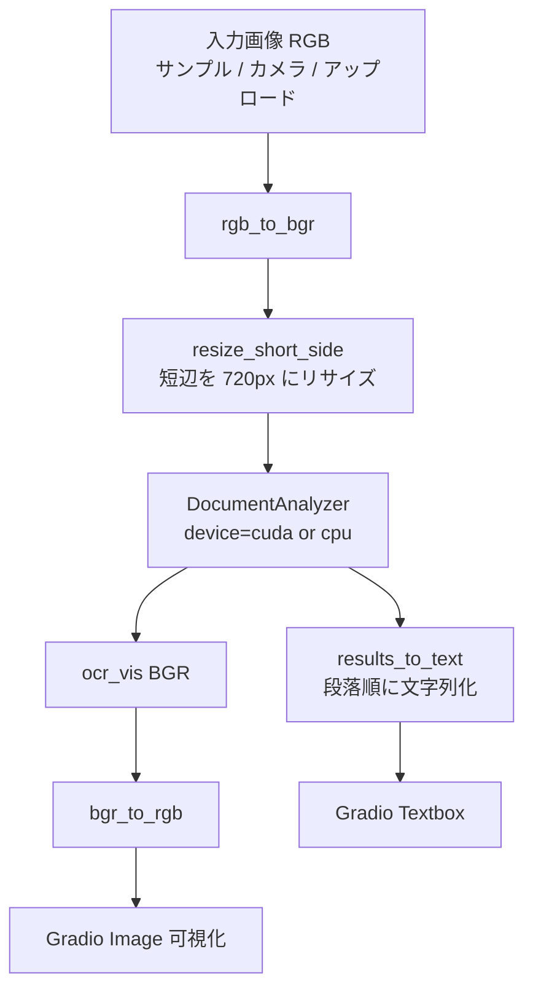
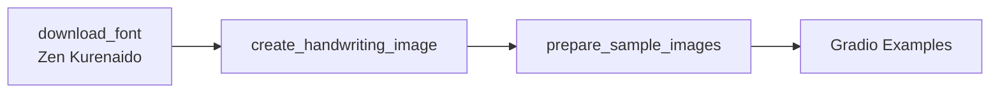

# document.md — 手書き文字認識デモ（OC_HandwritingOCR）

本ドキュメントは，オーダー `orders/order_001.md` に基づく YomiToku 手書き OCR デモの構成と，主要関数の関係をまとめたものである．

---

## 1. 成果物

| ファイル | 役割 |
| :--- | :--- |
| `OC_HandwritingOCR.ipynb` | Colab 上で完結する実行本体（インストール／初期化／Gradio） |
| `OC_HandwritingOCR.md` | 高校生・実施者向けの操作説明 |
| `document.md` | 本仕様・処理フローの解説 |

API キーは不要であり，`tokens.json` の読み込みは行わない．

---

## 2. ノートブックのセル構成

実行が途中で止まった場合に再開しやすいよう，次の段階に分割している．

0. **設定（Webカメラ・可視化）** — `MIRROR_WEBCAM` および `VIS_FONT_SIZE`（可視化の重ね文字サイズ）
1. **ライブラリのインストール** — `pip install yomitoku`
2. **ライブラリの読み込み，変数のインスタンス化** — デバイス判定，フォント取得，サンプル画像生成，`DocumentAnalyzer` の構築（`path_cfg` で `visualize.font_size` を指定），推論ヘルパの定義
3. **Gradio の実行** — UI 構築と `demo.launch(share=True)`

---

## 3. 処理フロー

サンプル準備は推論とは独立して，初期化セルで次の流れとなる．

---

## 4. 主要関数の仕様

### 4.1 環境・資産

| 関数 | 概要 | 主な入出力 |
| :--- | :--- | :--- |
| `resolve_device` | CUDA 可否を判定する | 戻り値: `str`（`"cuda"` / `"cpu"`） |
| `download_font` | 手書き風 TTF を取得する | `url: str`, `save_path: Path` → `Path` |
| `create_handwriting_image` | 罫線付きメモ風 RGB 画像を描画する | `text: str`, `font_path: Path` → `np.ndarray (H,W,3)` |
| `prepare_sample_images` | 複数サンプル PNG を保存する | `font_path`, `out_dir` → `list[str]` |

### 4.2 前処理・後処理

| 関数 | 概要 | 主な入出力 |
| :--- | :--- | :--- |
| `rgb_to_bgr` / `bgr_to_rgb` | 色空間変換（Gradio ↔ OpenCV） | `np.ndarray (H,W,3)` ↔ 同形状 |
| `resize_short_side` | 短辺が 720px になるよう縦横比を保ってリサイズする（カメラ等の入力を OCR 向けに揃える） | BGR `np.ndarray` → BGR `np.ndarray` |
| `results_to_text` | 段落（なければ単語）から文字列を組み立てる | `DocumentAnalyzerSchema` → `str` |
| `recognize_handwriting` | 推論の入口（Gradio コールバック） | RGB 画像 → `(text, RGB可視化)` |

### 4.3 UI

| 関数 | 概要 | 戻り値 |
| :--- | :--- | :--- |
| `build_demo` | 入力画像・結果テキスト・可視化・Examples を配置する | `gr.Blocks` |

入力コンポーネントは `sources=["upload", "webcam", "clipboard"]` とし，サンプル選択とカメラ撮影の両方に対応する．

---

## 5. モデル利用方針

- パッケージ: `yomitoku`（`DocumentAnalyzer`）
- `visualize=True` により OCR 可視化画像を取得する
- 既定の認識モデルは印刷・手書きの双方に対応する系列を使用する
- Colab T4 では `device="cuda"` を優先し，未検出時のみ CPU にフォールバックする

文字起こし結果は，読み順付きの `paragraphs` を優先し，段落が空の場合は `words` の連結にフォールバックする．

---

## 6. 依存関係（Colab 前提）

| パッケージ | 備考 |
| :--- | :--- |
| `yomitoku` | セル1でインストール |
| `gradio` | Colab 標準（本環境では 6.x 系） |
| `torch` / `opencv` / `pillow` / `numpy` | Colab 標準 |
| `tqdm` | サンプル生成ループの進捗表示（`leave=False`） |

PyTorch の再インストールは行わず，Colab 同梱の CUDA 対応ビルドを利用する．

---

## 7. 設計上の留意点

- ネストを浅く保つため，変換・短辺リサイズ・テキスト整形を独立関数に分割した
- 重いループはサンプル生成のみであり，`tqdm(..., leave=False)` で進捗を表示する
- ノートブック単体で動作するよう，サンプル画像はリポジトリ同梱ではなく実行時に生成する
- 商用 API は用いず，学習済みローカル推論のみでデモを完結させる
