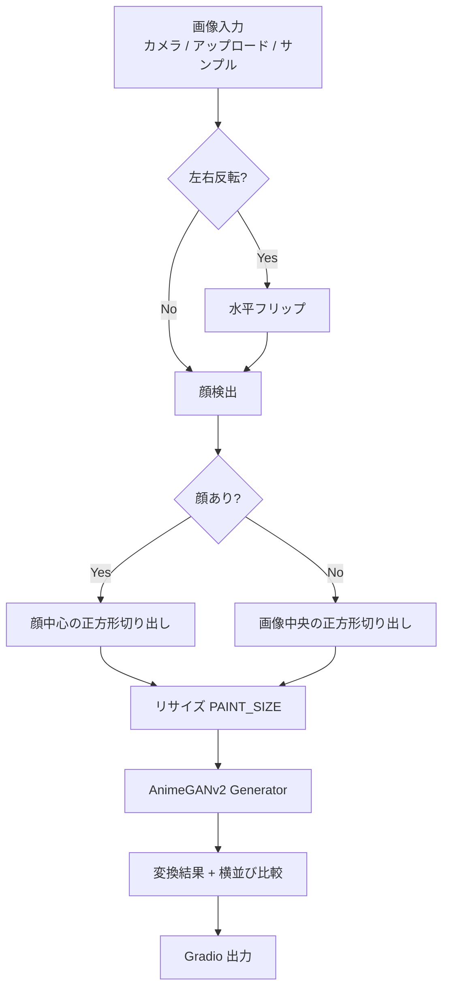
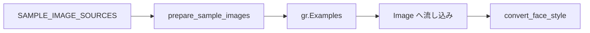

# document.md — 顔スタイル変換デモ（OC_FaceStyle）

本ドキュメントは，オーダー `orders/order_008.md` に基づく顔スタイル変換デモの構成と，主要関数の関係をまとめたものである．

---

## 1. 成果物

| ファイル | 役割 |
| :--- | :--- |
| `OC_FaceStyle.ipynb` | Colab 上で完結する実行本体（インストール／初期化／Gradio） |
| `OC_FaceStyle.md` | 高校生・実施者向けの操作説明 |
| `document.md` | 本仕様・処理フローの解説 |

スタイル変換は Colab 内の AnimeGANv2 推論のみで行い，Gemini API は用いない（API キー不要）．Hugging Face 認証も不要である（重みは GitHub の `torch.hub` から取得）．

---

## 2. ノートブックのセル構成

実行が途中で止まった場合に再開しやすいよう，次の段階に分割している．

0. **設定** — `MIRROR_WEBCAM`，`PAINT_SIZE`，`FACE_MARGIN`，`DEFAULT_STYLE`
1. **ライブラリのインストール** — `tqdm` の更新（本体は Colab 標準）
2. **ライブラリの読み込み，変数のインスタンス化** — フォント／サンプル画像のダウンロード，4 スタイルの Generator とヘルパの定義
3. **Gradio の実行** — UI 構築と `demo.launch(share=True)`

---

## 3. 処理フロー

サンプル画像は推論とは独立に URL から取得し，Gradio Examples に渡す．

スタイルキーと日本語表示の対応は次のとおりである．

| スタイルキー | 表示名 |
| :--- | :--- |
| `face_paint_512_v2` | アニメキャラ風（推奨） |
| `face_paint_512_v1` | アニメ似顔絵風 |
| `celeba_distill` | やさしいイラスト風 |
| `paprika` | 映画イラスト・絵画風 |

---

## 4. 主要関数の仕様

### 4.1 環境・データ準備

| 関数 | 概要 | 主な入出力 |
| :--- | :--- | :--- |
| `resolve_device` | CUDA 可否を判定する | → `str`（`"cuda"` / `"cpu"`） |
| `download_file` | URL から画像を取得し長辺を制限して保存する | `url: str`, `save_path: Path` → `Path` |
| `download_font` | 日本語ラベル用フォントを取得する | `url`, `save_path` → `Path` |
| `prepare_sample_images` | サンプル顔写真を一括ダウンロードする | `sources`, `sample_dir` → `list[tuple[str, Path]]` |
| `load_face_cascade` | OpenCV Haar Cascade を読み込む | → `cv2.CascadeClassifier` |
| `load_style_models` | 各スタイルの Generator を `torch.hub` で読み込む | `style_keys`, `device` → `dict[str, Module]` |

### 4.2 前処理・変換

| 関数 | 概要 | 主な入出力 |
| :--- | :--- | :--- |
| `to_rgb_uint8` | Gradio 入力を RGB `uint8` に揃える | `image` → `np.ndarray (H,W,3)` または `None` |
| `detect_largest_face` | 最大の顔枠を返す | `rgb`, `cascade`, `margin` → `(x1,y1,x2,y2)` または `None` |
| `crop_square_face` | 顔中心（または中央）の正方形を切り出す | `rgb`, `box` → `(crop, note)` |
| `stylize_face` | AnimeGANv2 でスタイル変換する | `face_rgb`, `model`, `device`, `size` → `PIL.Image` |
| `make_side_by_side` | 変換前後を横並びにしラベルを付ける | `before`, `after`, `style_label` → `np.ndarray (H,2W,3)` |
| `style_key_from_label` | 日本語ラベルからスタイルキーへ変換する | `label: str` → `str` |
| `convert_face_style` | Gradio 用の一連推論 | `image`, `style_label`, `mirror` → `(結果, 比較, 説明)` |
| `build_demo` | Gradio Blocks を構築する | `sample_items`, `mirror_webcam` → `gr.Blocks` |

`stylize_face` では入力を $[-1, 1]$ に正規化し，出力を $[0, 1]$ に戻して PIL 画像とする．変換解像度は設定セルの `PAINT_SIZE`（既定 $512$）である．

---

## 5. Gradio UI の入出力

| 種別 | コンポーネント | 内容 |
| :--- | :--- | :--- |
| 入力 | `gr.Image` | カメラ／アップロード（`webcam_options` でミラー設定） |
| 入力 | `gr.Dropdown` | 4 スタイルの日本語名 |
| 入力 | `gr.Checkbox` | アップロード画像向けの左右反転 |
| 出力 | `gr.Image` | 変換結果 |
| 出力 | `gr.Image` | 変換前／変換後の比較 |
| 出力 | `gr.Textbox` | スタイル・切り出し方法などの説明 |
| 補助 | `gr.Examples` | インターネットから取得したサンプル顔写真 |

ボタンクリックに加え，画像変更・スタイル変更でも `convert_face_style` を呼ぶ．

---

## 6. 依存関係と認証

- **実行基盤**: Google Colab，Python 3.12 系，CUDA 対応 PyTorch（T4 想定）
- **主要ライブラリ**: `torch`，`torchvision`，`opencv-python`，`Pillow`，`gradio`，`tqdm`
- **モデル取得**: `torch.hub.load("bryandlee/animegan2-pytorch:main", "generator", ...)`
- **API キー**: 不要
- **Hugging Face ログイン**: 不要

---

## 7. オーダー要件との対応

| 要件 | 対応 |
| :--- | :--- |
| Colab T4 で動作 | 軽量な AnimeGANv2，解像度 512 |
| Gradio で画像入力 | カメラ／アップロード／Examples |
| サンプル入力 | Wikimedia / Pexels の顔写真を DL |
| ipynb のみ | `OC_FaceStyle.ipynb` に完結 |
| セル分割 | インストール／初期化／Gradio |
| Colab バッジ | ノートブック先頭に配置 |
| 顔のスタイル変換 | アニメキャラ化・絵画寄りの 4 スタイル |
| 撮影不要でも試せる | インターネット上のサンプル画像を用意 |
