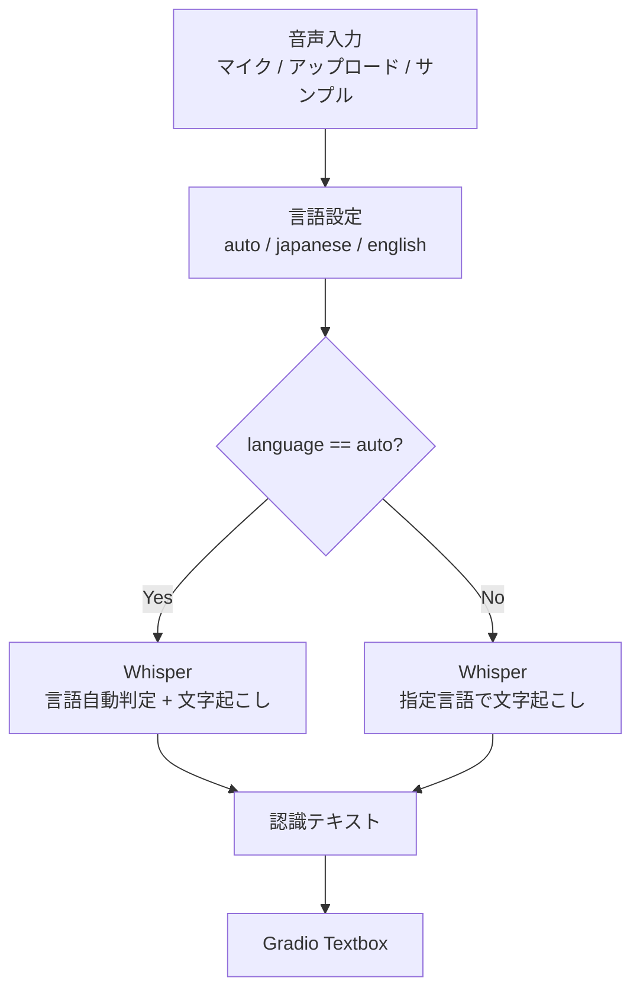

# document.md — 音声認識デモ（OC_SpeechRecognition）

本ドキュメントは，オーダー `orders/order_003.md` に基づく Whisper 音声認識デモの構成と，主要関数の関係をまとめたものである．

---

## 1. 成果物

| ファイル | 役割 |
| :--- | :--- |
| `OC_SpeechRecognition.ipynb` | Colab 上で完結する実行本体（インストール／初期化／Gradio） |
| `OC_SpeechRecognition.md` | 高校生・実施者向けの操作説明 |
| `document.md` | 本仕様・処理フローの解説 |

音声認識は Colab 内の Whisper 推論のみで行い，Gemini API は用いない（API キー不要）．

---

## 2. ノートブックのセル構成

実行が途中で止まった場合に再開しやすいよう，次の段階に分割している．

0. **設定** — `MODEL_ID`，`DEFAULT_LANGUAGE`
1. **ライブラリのインストール** — `transformers` の更新
2. **ライブラリの読み込み，変数のインスタンス化** — サンプル音声のダウンロード，ASR パイプラインの構築，推論ヘルパの定義
3. **Gradio の実行** — UI 構築と `demo.launch(share=True)`

---

## 3. 処理フロー

サンプル音声は推論とは独立に URL から取得し，Gradio Examples に渡す．

---

## 4. 主要関数の仕様

### 4.1 環境・データ準備

| 関数 | 概要 | 主な入出力 |
| :--- | :--- | :--- |
| `resolve_device` | CUDA 可否を判定する | 戻り値: `str`（`"cuda"` / `"cpu"`） |
| `download_file` | URL からファイルを取得する（既存ならスキップ） | `url: str`, `save_path: Path` → `Path` |
| `prepare_sample_audios` | 日本語・英語サンプルを一括ダウンロードする | `sources`, `sample_dir` → `list[tuple[str, Path]]` |

### 4.2 認識

| 関数 | 概要 | 主な入出力 |
| :--- | :--- | :--- |
| `load_asr_pipeline` | Transformers の ASR パイプラインを構築する | `model_id`, `device` → `Pipeline` |
| `transcribe_audio` | 文字起こしの入口（Gradio コールバック） | `audio_path`, `language` → `str` |

### 4.3 UI

| 関数 | 概要 | 戻り値 |
| :--- | :--- | :--- |
| `build_demo` | 音声入力・言語選択・認識結果・Examples を配置する | `gr.Blocks` |

入力は音声（マイク／アップロード）を主とし，サンプルは Examples で提供する．

---

## 5. モデル利用方針

- パッケージ: `transformers.pipeline`（`task="automatic-speech-recognition"`）
- モデル ID: `openai/whisper-small`（設定セルで変更可能）
- 参考 URL: https://huggingface.co/openai/whisper-small
- 精度: CUDA 時 `torch.float16`，CPU 時 `torch.float32`
- タスク: `transcribe`（翻訳タスク `translate` は用いない）
- 言語: `auto` のときは `generate_kwargs` に `language` を渡さず自動判定とする

多言語学習済みモデルであるため，日本語と英語の双方を同一パイプラインで扱う．

---

## 6. 依存関係（Colab 前提）

| パッケージ | 備考 |
| :--- | :--- |
| `transformers` | セル1で必要に応じ更新 |
| `gradio` | Colab 標準（本環境では 6.x 系） |
| `torch` / `torchaudio` | Colab 標準 |
| `soundfile` / `librosa` | 音声読み込み（Colab 標準） |
| `tqdm` | サンプル DL および推論の進捗（`leave=False`） |

PyTorch の再インストールは行わず，Colab 同梱の CUDA 対応ビルドを利用する．

---

## 7. サンプル音声

| ローカル名 | 出典 |
| :--- | :--- |
| `japanese_jsut.flac` | `japanese-asr/ja_asr.jsut_basic5000` の公開 `sample.flac` |
| `japanese_cv.flac` | `japanese-asr/ja_asr.common_voice_8_0` の公開 `sample.flac` |
| `english_jfk.flac` | OpenAI Whisper リポジトリのテスト音声 `tests/jfk.flac` |

ノートブック単体で動作するよう，リポジトリへの音声同梱は行わず，初期化時にダウンロードする．

---

## 8. 設計上の留意点

- ネストを浅く保つため，デバイス判定・DL・パイプライン構築・認識・UI を独立関数に分割した
- 重い処理の進捗は `tqdm(..., leave=False)` で可視化する
- API キーは不要とし，ノートブック本文へ秘密情報を埋め込まない
- マイク利用が難しい環境でも，アップロードとサンプルで動作確認できるようにした
