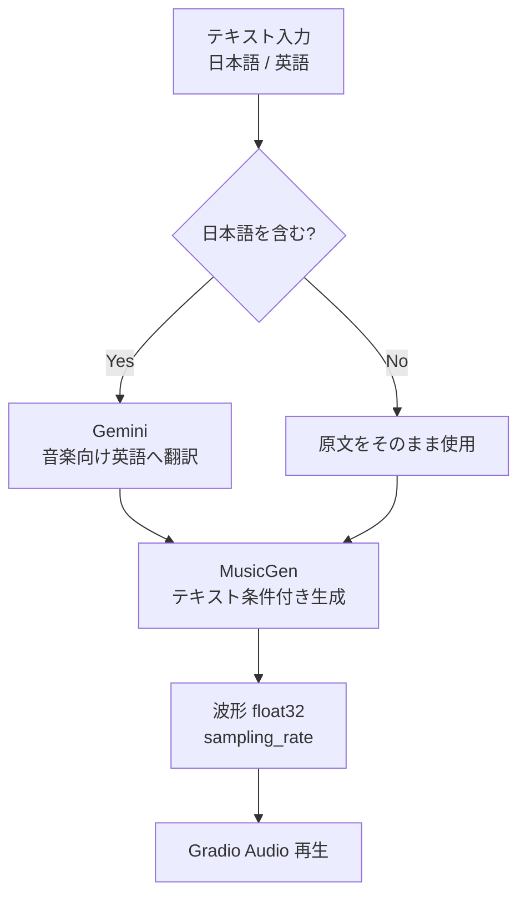
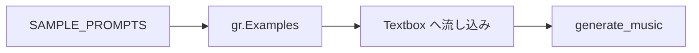

# document.md — AI音楽生成デモ（OC_MusicGen）

本ドキュメントは，オーダー `orders/order_010.md` に基づく AI 音楽生成デモの構成と，主要関数の関係をまとめたものである．

---

## 1. 成果物

| ファイル | 役割 |
| :--- | :--- |
| `OC_MusicGen.ipynb` | Colab 上で完結する実行本体（インストール／初期化／Gradio） |
| `OC_MusicGen.md` | 高校生・実施者向けの操作説明 |
| `document.md` | 本仕様・処理フローの解説 |

音楽生成は Colab 内の MusicGen 推論で行い，日本語プロンプトの英訳にのみ Gemini API（`gemini-2.5-flash`）を用いる．Hugging Face 認証は不要である（公開モデルを自動ダウンロード）．

---

## 2. ノートブックのセル構成

実行が途中で止まった場合に再開しやすいよう，次の段階に分割している．

0. **設定** — `MODEL_ID`，`DURATION_SEC`，`GUIDANCE_SCALE`，`GEMINI_MODEL`
1. **ライブラリのインストール** — `transformers` / `google-genai` の更新
2. **ライブラリの読み込み，変数のインスタンス化** — `tokens.json`，MusicGen，ヘルパ関数
3. **Gradio の実行** — UI 構築と `demo.launch(share=True)`

---

## 3. 処理フロー

ユーザーは自然言語でジャンル・雰囲気・楽器などを指定する．日本語は Gemini で英語へ翻訳し，MusicGen が波形を生成する．

サンプルプロンプトは推論とは独立に定数として保持し，Gradio Examples に渡す．

秒数とトークン数の関係は次式で近似する．MusicGen は約 $50$ フレーム／秒でトークンを進める．

$$
\max\_new\_tokens \approx \mathrm{round}(T \times 50)
$$

ここで $T$ は生成したい秒数（秒）である．

モデルサイズと用途の対応は次のとおりである．

| モデル ID | 規模 | 用途 |
| :--- | :--- | :--- |
| `facebook/musicgen-small` | 約 300M | T4 既定（速度重視） |
| `facebook/musicgen-medium` | 約 1.5B | 品質寄り（VRAM・時間↑） |

---

## 4. 主要関数の仕様

### 4.1 環境・翻訳

| 関数 | 概要 | 主な入出力 |
| :--- | :--- | :--- |
| `load_tokens` | `tokens.json` から API キーを読む | `path: Path` → `dict` |
| `resolve_device` | CUDA 可否を判定する | → `str`（`"cuda"` / `"cpu"`） |
| `contains_japanese` | ひらがな・カタカナ・漢字の有無を判定する | `text: str` → `bool` |
| `translate_prompt_to_english` | 日本語を MusicGen 向け英語へ翻訳する | `prompt`, `client`, `model` → `str` |

### 4.2 音楽生成

| 関数 | 概要 | 主な入出力 |
| :--- | :--- | :--- |
| `duration_to_max_new_tokens` | 秒数を `max_new_tokens` に変換する | `duration_sec: float` → `int` |
| `load_musicgen` | プロセッサとモデルを読み込む | `model_id`, `device` → `(processor, model, sampling_rate)` |
| `generate_music` | プロンプトから音楽を生成する | `prompt`, `duration_sec`, `seed` → `((sr, waveform), note)` |
| `build_demo` | Gradio UI を構築する | → `gr.Blocks` |

`generate_music` の戻り値における波形は `np.ndarray`（`float32`，shape=`(samples,)`）である．Gradio の `Audio(type="numpy")` には `(sampling_rate, waveform)` のタプルを渡す．

---

## 5. Gradio UI

| 要素 | 役割 |
| :--- | :--- |
| プロンプト Textbox | 自然言語での音楽指定 |
| 生成秒数 Slider | $2$〜$15$ 秒（長いほど推論時間が増加） |
| シード Number | 再現用．負値でランダム |
| 生成ボタン | `generate_music` を実行 |
| Audio / 英語プロンプト | 結果の再生と翻訳確認 |
| Examples | サンプルプロンプトのワンクリック入力 |

---

## 6. 依存と制約

- **実行環境**: Google Colab，T4（VRAM 約 14GB）を想定する．
- **API**: Gemini（`tokens.json` の `gemini`）が必要である．
- **Hugging Face**: `facebook/musicgen-small` は公開モデルであり，認証は不要である．
- **ライセンス**: MusicGen は CC-BY-NC 4.0（非営利）．教育デモ用途を想定する．
- **品質**: 歌声付き楽曲や特定曲の再現は苦手なことが多い．短いインストゥルメンタル向けである．
