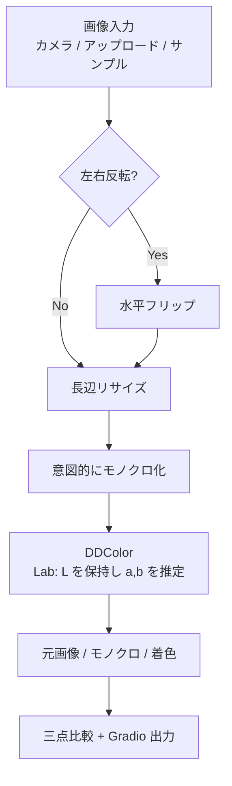
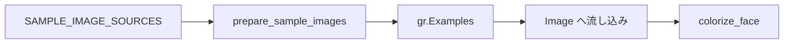

# document.md — AI着色デモ（OC_Colorize）

本ドキュメントは，オーダー `orders/order_009.md` に基づく AI 着色デモの構成と，主要関数の関係をまとめたものである．

---

## 1. 成果物

| ファイル | 役割 |
| :--- | :--- |
| `OC_Colorize.ipynb` | Colab 上で完結する実行本体（インストール／初期化／Gradio） |
| `OC_Colorize.md` | 高校生・実施者向けの操作説明 |
| `document.md` | 本仕様・処理フローの解説 |

着色は Colab 内の DDColor 推論のみで行い，Gemini API は用いない（API キー不要）．Hugging Face 認証も不要である（公開モデルを自動ダウンロード）．

---

## 2. ノートブックのセル構成

実行が途中で止まった場合に再開しやすいよう，次の段階に分割している．

0. **設定** — `MIRROR_WEBCAM`，`MODEL_NAME`，`INPUT_SIZE`，`MAX_IMAGE_SIDE`
1. **ライブラリのインストール** — DDColor リポジトリのクローン，`tqdm` / `huggingface_hub` の更新
2. **ライブラリの読み込み，変数のインスタンス化** — フォント／サンプル画像のダウンロード，DDColor とヘルパの定義
3. **Gradio の実行** — UI 構築と `demo.launch(share=True)`

---

## 3. 処理フロー

入力はカラー顔写真を想定する．デモの意図として，いったんモノクロへ落としてから AI に渡す．

サンプル画像は推論とは独立に URL から取得し，Gradio Examples に渡す．

モデル名と用途の対応は次のとおりである．

| モデル名 | 用途 |
| :--- | :--- |
| `ddcolor_modelscope` | 画質重視（既定） |
| `ddcolor_artistic` | アーティスティック寄り |
| `ddcolor_paper_tiny` | 軽量・高速 |
| `ddcolor_paper` | 論文再現用 |

---

## 4. 主要関数の仕様

### 4.1 環境・データ準備

| 関数 | 概要 | 主な入出力 |
| :--- | :--- | :--- |
| `resolve_device` | CUDA 可否を判定する | → `str`（`"cuda"` / `"cpu"`） |
| `download_file` | URL から画像を取得し長辺を制限して保存する | `url: str`, `save_path: Path` → `Path` |
| `download_font` | 日本語ラベル用フォントを取得する | `url`, `save_path` → `Path` |
| `prepare_sample_images` | サンプル顔写真を一括ダウンロードする | `sources`, `sample_dir` → `list[tuple[str, Path]]` |
| `load_colorizer` | DDColor を HF から読み込みパイプライン化する | `model_name`, `input_size`, `device` → `ColorizationPipeline` |

### 4.2 前処理・着色

| 関数 | 概要 | 主な入出力 |
| :--- | :--- | :--- |
| `to_rgb_uint8` | Gradio 入力を RGB `uint8` に揃える | `image` → `np.ndarray (H,W,3)` または `None` |
| `resize_max_side` | 長辺を上限以下へ縮小する | `rgb`, `max_side` → `np.ndarray` |
| `to_grayscale_rgb` | カラーを意図的にモノクロ RGB へ変換する | `rgb (H,W,3)` → `np.ndarray (H,W,3)` |
| `colorize_rgb` | DDColor で着色し RGB で返す | `gray_rgb`, `colorizer` → `np.ndarray (H,W,3)` |
| `make_triple_compare` | 元／モノクロ／着色を横並びにしラベルを付ける | 3 枚の RGB → `np.ndarray (H',3W,3)` |
| `colorize_face` | Gradio 用の一連推論 | `image`, `mirror` → `(元, モノクロ, 着色, 比較, 説明)` |
| `build_demo` | Gradio Blocks を構築する | `sample_items`, `mirror_webcam` → `gr.Blocks` |

DDColor 内部では入力を Lab に変換し，輝度 $L$ を保持したまま色差 $a$，$b$ を推定する．入力解像度は設定セルの `INPUT_SIZE`（既定 $512$）である．

---

## 5. Gradio UI の入出力

| 種別 | コンポーネント | 内容 |
| :--- | :--- | :--- |
| 入力 | `gr.Image` | カメラ／アップロード（`webcam_options` でミラー設定） |
| 入力 | `gr.Checkbox` | アップロード画像向けの左右反転 |
| 出力 | `gr.Image` | 三点比較（元／モノクロ／着色） |
| 出力 | `gr.Image` ×3 | 元画像，モノクロ画像，着色画像 |
| 出力 | `gr.Textbox` | モデル名・解像度などの説明 |
| 補助 | `gr.Examples` | インターネットから取得したサンプル顔写真 |

ボタンクリックに加え，画像変更でも `colorize_face` を呼ぶ．

---

## 6. 依存関係と認証

- **実行基盤**: Google Colab，Python 3.12 系，CUDA 対応 PyTorch（T4 想定）
- **主要ライブラリ**: `torch`，`opencv-python`，`Pillow`，`gradio`，`tqdm`，`huggingface_hub`
- **モデルコード**: `git clone https://github.com/piddnad/DDColor.git`
- **モデル取得**: `DDColorHF.from_pretrained("piddnad/{MODEL_NAME}")`
- **API キー**: 不要
- **Hugging Face ログイン**: 不要

---

## 7. オーダー要件との対応

| 要件 | 対応 |
| :--- | :--- |
| Colab T4 で動作 | DDColor（既定 modelscope，必要なら tiny），解像度 512 |
| Gradio で画像入力 | カメラ／アップロード／Examples |
| サンプル入力 | Wikimedia / Pexels の顔写真を DL |
| ipynb のみ | `OC_Colorize.ipynb` に完結 |
| セル分割 | インストール／初期化／Gradio |
| Colab バッジ | ノートブック先頭に配置 |
| AI 着色 | 入力をモノクロ化し DDColor で着色 |
| 撮影不要でも試せる | インターネット上のサンプル画像を用意 |
| 三点対比 | 元画像・モノクロ・着色を個別表示＋横並び比較 |
