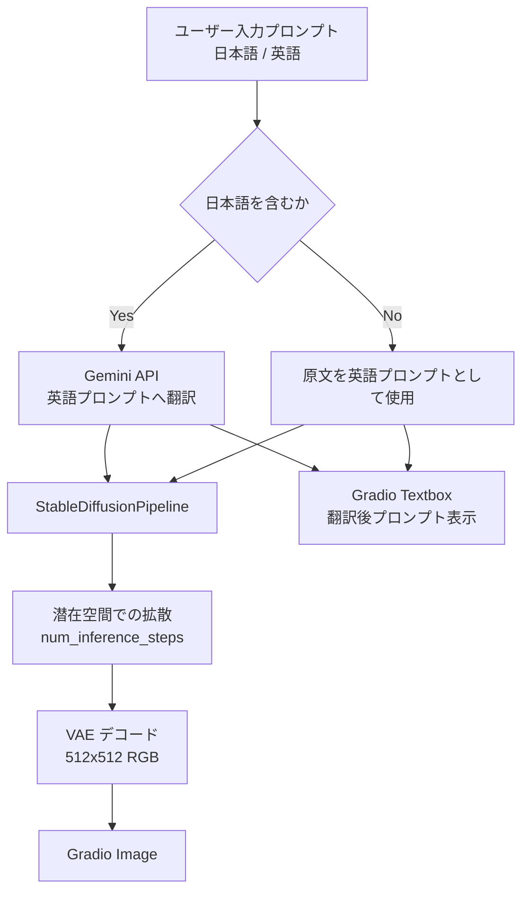

# document.md — 画像生成デモ（OC_ImageGen）

本ドキュメントは，オーダー `orders/order_002.md` に基づく Stable Diffusion 画像生成デモの構成と，主要関数の関係をまとめたものである．

---

## 1. 成果物

| ファイル | 役割 |
| :--- | :--- |
| `OC_ImageGen.ipynb` | Colab 上で完結する実行本体（インストール／初期化／Gradio） |
| `OC_ImageGen.md` | 高校生・実施者向けの操作説明 |
| `document.md` | 本仕様・処理フローの解説 |

日本語プロンプトの英訳には Gemini API（`tokens.json` の `gemini`）を用いる．  
Stable Diffusion 本体の Hugging Face 認証は，現時点では不要である（公開モデル）．

---

## 2. ノートブックのセル構成

実行が途中で止まった場合に再開しやすいよう，次の段階に分割している．

0. **設定** — `MODEL_ID`，`IMAGE_SIZE`，`NUM_INFERENCE_STEPS`，`GUIDANCE_SCALE`，`GEMINI_MODEL`
1. **ライブラリのインストール** — `diffusers` / `google-genai` の更新
2. **ライブラリの読み込み，変数のインスタンス化** — `tokens.json` 読み込み，Gemini クライアント，`StableDiffusionPipeline` の構築，推論ヘルパの定義
3. **Gradio の実行** — UI 構築と `demo.launch(share=True)`

---

## 3. 処理フロー

サンプルプロンプトは推論とは独立に定数 `SAMPLE_PROMPTS` として保持し，Gradio Examples に渡す．

---

## 4. 主要関数の仕様

### 4.1 環境・認証

| 関数 | 概要 | 主な入出力 |
| :--- | :--- | :--- |
| `load_tokens` | `tokens.json` を読み，`gemini` の有無を検証する | `path: Path` → `dict` |
| `resolve_device` | CUDA 可否を判定する | 戻り値: `str`（`"cuda"` / `"cpu"`） |

### 4.2 プロンプト処理

| 関数 | 概要 | 主な入出力 |
| :--- | :--- | :--- |
| `contains_japanese` | ひらがな・カタカナ・漢字の有無を判定する | `text: str` → `bool` |
| `translate_prompt_to_english` | 日本語のみ Gemini で英訳する．英語はそのまま返す | `prompt`, `client`, `model` → `str` |

### 4.3 生成

| 関数 | 概要 | 主な入出力 |
| :--- | :--- | :--- |
| `load_pipeline` | Diffusers の SD パイプラインを fp16（CUDA）で読み込む | `model_id`, `device` → `StableDiffusionPipeline` |
| `generate_image` | 翻訳→生成の入口（Gradio コールバック） | `prompt`, `seed` → `(PIL.Image \| None, str)` |

### 4.4 UI

| 関数 | 概要 | 戻り値 |
| :--- | :--- | :--- |
| `build_demo` | プロンプト入力・シード・生成画像・翻訳結果・Examples を配置する | `gr.Blocks` |

入力は文章（Textbox）とし，画像・音声入力は本デモの主用途ではないため用いない．サンプル入力は Examples で提供する．

---

## 5. モデル利用方針

- パッケージ: `diffusers.StableDiffusionPipeline`
- モデル ID: `sd-legacy/stable-diffusion-v1-5`（公開ミラー．認証不要）
- 参考 URL: https://huggingface.co/sd-legacy/stable-diffusion-v1-5
- 解像度: $512 \times 512$（T4 の VRAM 約 14GB 向け）
- 精度: CUDA 時 `torch.float16`，CPU 時 `torch.float32`
- VRAM 対策: `enable_attention_slicing()` を有効化する
- 翻訳モデル: Gemini（既定 `gemini-2.0-flash`）

英語キャプション中心の学習データに合わせ，日本語入力は翻訳後に拡散モデルへ渡す．

---

## 6. 依存関係（Colab 前提）

| パッケージ | 備考 |
| :--- | :--- |
| `diffusers` | セル1で必要に応じ更新（環境情報では 0.39 系） |
| `google-genai` | Gemini クライアント |
| `gradio` | Colab 標準（本環境では 6.x 系） |
| `torch` / `transformers` / `accelerate` / `pillow` | Colab 標準 |
| `tqdm` | パイプライン準備および拡散ステップの進捗（`leave=False`） |

PyTorch の再インストールは行わず，Colab 同梱の CUDA 対応ビルドを利用する．

---

## 7. 設計上の留意点

- ネストを浅く保つため，トークン読込・言語判定・翻訳・パイプライン読込・生成を独立関数に分割した
- 重い処理の進捗は `tqdm(..., leave=False)` および Diffusers 側プログレスバーで可視化する
- ノートブック単体で動作するよう，サンプルはリポジトリ同梱画像ではなく文字列定数とする
- API キーは `tokens.json` のみから読み，ノートブック本文へ埋め込まない
- 将来モデルが gated になった場合は，モデルページでの同意と `huggingface_hub` トークンによるログインを想定する
